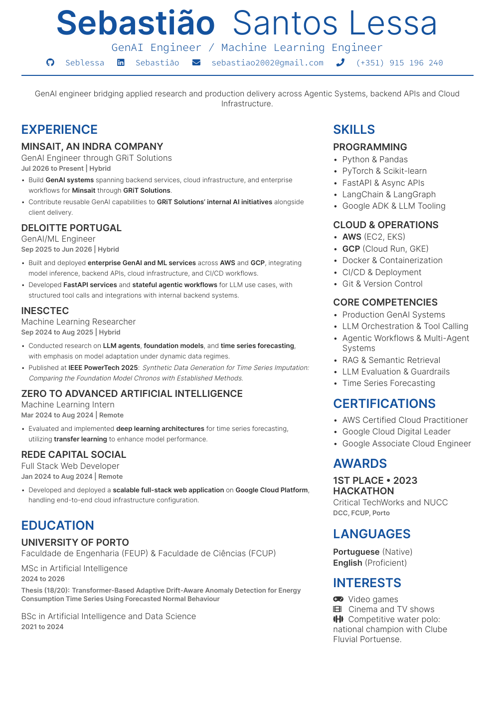

<div align="center">

<h1>Curriculum Vitae</h1>

<p>A clean, one-page A4 CV built with LuaLaTeX.</p>

<p><a href="./seb-cv.pdf"><strong>View the latest PDF</strong></a> · <a href="./seb-cv.tex">Browse the LaTeX source</a></p>

<a href="./seb-cv.pdf">
  
</a>

</div>

## About

This repository contains the source and generated PDF for my CV. The layout is designed to keep professional experience prominent while fitting skills, certifications, education, and personal details into a readable two-column page.

- A4, single-page layout
- Clickable contact details and external links
- Bundled fonts for consistent rendering
- Reproducible build with one command

## Use the template

The reusable version lives in [`template/`](./template). It is self-contained and has no personal CV content or historical PDFs.

Git cannot clone a single directory directly, but sparse checkout gives the same result:

```bash
git clone --filter=blob:none --no-checkout https://github.com/seblessa/Curriculum-Vitae.git my-cv
cd my-cv
git sparse-checkout set --no-cone /template/
git checkout
cd template
```

Only the `template/` directory is checked out. Then:

1. Replace the example content in `cv.tex`.
2. Run `./build_cv.py --clean`.
3. Open `cv.pdf`.

See the [template guide](./template/README.md), the [macOS and Windows setup guide](./template/SETUP.md), or the [compiled example](./template/cv.pdf) for more detail.

## Project structure

| Path | Purpose |
| --- | --- |
| `seb-cv.tex` | CV content |
| `seb-cv.cls` | Layout, typography, colors, and reusable commands |
| `build_cv.py` | Build entry point |
| `seb-cv.pdf` | Latest generated CV |
| `fonts/` | Bundled fonts and their licences |
| `legacy/` | Personal yearly PDF snapshots |
| `assets/` | README preview image |
| `template/` | Standalone, reusable CV template |

## Building my CV

For a fresh machine, follow the [installation and agent workflow guide](./template/SETUP.md) first.

For regular edits:

```bash
./build_cv.py
```

For a clean rebuild:

```bash
./build_cv.py --clean
```

Each successful build updates `seb-cv.pdf` and the current-year PDF in `legacy/`. Auxiliary LaTeX files stay in the ignored `.out/` directory.

After changing the layout, check that the PDF is still one page and that no text is clipped or overlapping.
